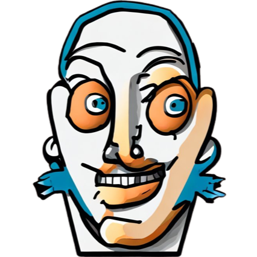
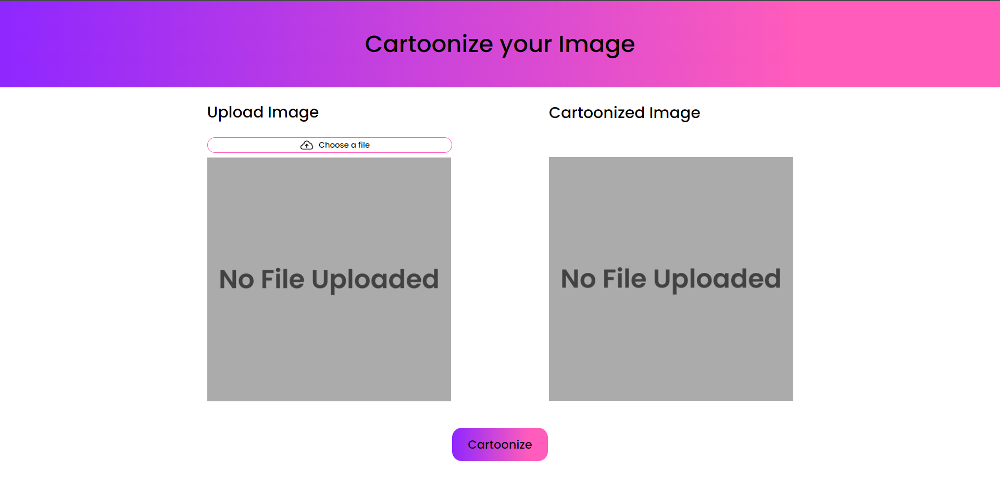
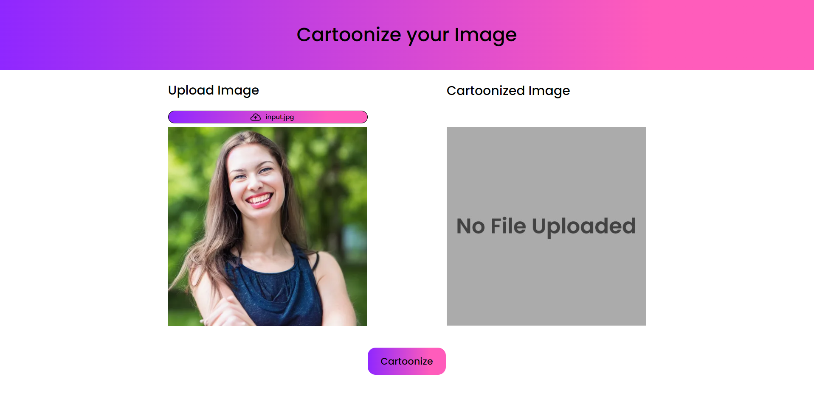
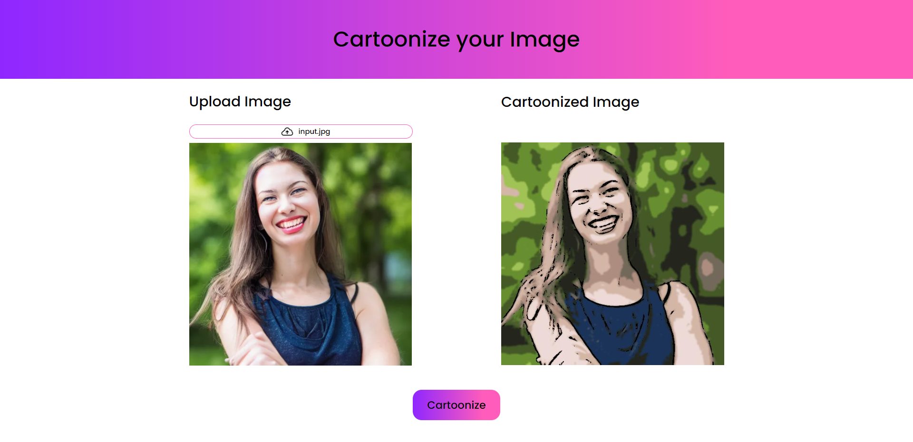

<div align="center">


# Image Cartoonizer
</div>

A cartoonization project that takes an image provided by the user and applies filters and transformations to create a cartoon-like version of the original image. This is be done using various image processing techniques and algorithms provided by `OpenCV` library in ``Python``.

## Features

- Ability to upload images from the user's device
- Real-time preview of the cartoonized image
- Option to save or share the cartoonized image
- User-friendly interface and easy-to-use controls 

## OpenCV Model Overview

We have used ``OpenCV`` library in `Python` for applying all the image processing and masking options:
- ### Reading the image
  We extract the image from the `request` object of the `Flask` server and process it using `Pillow` and then convert it into a `numpy` array for further processing as `cv2.imread()` cannot take an image(file) as an input parameter

  ```python
  file = request.files['image']
  image = Image.open(file)
  img_np = np.array(image)
  ```
- ### Creating an edge mask
  Cartoons usually contain a distinguishable edge. We can detect the edge in an image by using the `cv2.adaptiveThreshold()` function.
  ```python
  def edge_mask(img, line_size, blur_value):
    gray = cv2.cvtColor(img, cv2.COLOR_BGR2GRAY)
    gray_blur = cv2.medianBlur(gray, blur_value)
    
    return cv2.adaptiveThreshold(
        gray_blur,
        255,
        cv2.ADAPTIVE_THRESH_MEAN_C,
        cv2.THRESH_BINARY,
        line_size,
        blur_value,
    )
  ```
- ### Decreasing the number of colors in the image
  A drawing has fewer colors than a photo. Therefore, we use color quantization to reduce the number of colors in the photo. We use `K-Means clustering` algorithm which is provided by the `OpenCV` library.

  ```python
    # K-Means clustering algo, we use a k-value of 9 here
    ret, label, center = cv2.kmeans(
      data, 
      k, 
      None, 
      criteria, 
      10, 
      cv2.KMEANS_RANDOM_CENTERS
    )
    
    center = np.uint8(center)
    result = center[label.flatten()]
    result = result.reshape(img.shape) # Final image
  ```
  Then we blur the image for redusing some of the noise. We choose the `bilateralFilter` for blurring the image as it replaces the intensity of each pixel with a weighted average of intensity values from nearby pixels.

  ```python
  blurred = cv2.bilateralFilter(
      img_np, 
      d=7, 
      sigmaColor=200, 
      sigmaSpace=200
    )
  ```
- ### Combining edge mask with original image
  Lastly, we combine the edge mask with the blurred image. To do so, use the `cv2.bitwise_and` method.
  ```python
  cartoon = cv2.bitwise_and(blurred, blurred, mask=edges)
  ```
---
## API Reference

#### Get the cartoonized image

```http
  POST /api/cartoonize
```

| Parameter | Type                | Description                    |
| :-------- | :------------------ | :----------------------------- |
| `image`   | `file/input_buffer` | The image uploaded by the user |


Takes the file uploaded by the user in the frontend and converts it into an input buffer using the `numpy` library in `Python` and then applies image processing and blurring techniques provided by `OpenCV`.

**Request object**: The file uploaded by the user is sent in the request object to the server. This is done in the frontend by using the `FormData` object and `Axios` package.

```js
const formData = new FormData();
formData.append('image', selectedImage);
await axios.request({
  method: 'POST',
  url: 'http://localhost:5000/api/cartoonize',
  data: formData,  //the image is attached in the formData variable
  headers: {
    'Content-Type': 'multipart/form-data',
  },
  withCredentials: true,
  responseType: 'arraybuffer', //response type of the server route
})
```

**Response object**: The cartoonized image is converted to array buffer of bytes and send in the Response object having the property `mimetype='image/jpeg'`.

```python
  img_byte_arr = io.BytesIO() # convert to bytes buffer
  cartoon.save(img_byte_arr, format='JPEG')
  img_byte_arr = img_byte_arr.getvalue() # get the value of the converted filetype

  return Response(img_byte_arr, mimetype='image/jpeg') # Flask Response object
```
---

## Installation

The project is built with `Python` and `JavaScript`(`React`)

```bash
  cd /any-folder
  git clone https://github.com/DarthSalad/image-cartoonizer.git
```

## Python Server and Model
- Go into the folder to build the virtual environment for running the Python web app through Flask

```bash
  cd image-cartoonizer
  python -m venv ./venv
```
- Activate the virtual environment
    - Windows (PowerShell)
    ```bash
    ./venv/Scripts/Activate.ps1
    ```
    - Linux
    ```bash
    source ./venv/bin/activate
    ```
- Install the dependencies
```bash
pip install -r "requirements.txt"
```
- Run the app
```bash
python main.py
```

## For the React app
- Go into the web-app folder
```bash
cd web-app
```
- Run the npm command to install all the dependencies
```bash
npm i
```
- Run the React app 
```bash
npm start
```
---
    
## Screenshots

#### Home Page


#### Upload a picture


#### Click on 'Cartoonize' and see the results



## Authors

- [@DarthSalad](https://www.github.com/DarthSalad)
- [@karteek-02](https://github.com/karteek-02)
- []()

